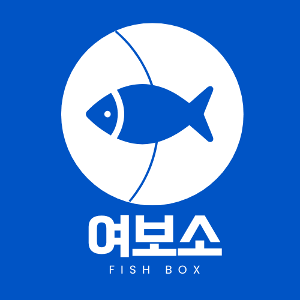

# 🦐여보소(SeaHere)

  
   
  전체 프로젝트 기간 : 2024-07-15 ~ 2024-08-29  
  프로젝트 개요~~~~

  <a href="https://www.notion.so/c6626df97574434a8b9f8358b00ece75?v=6f696739249448e392872058a527721e">팀 노션</a>
  &nbsp; | &nbsp; 
  <a href="https://www.notion.so/API-685de6db49e44954af21b2448a3d9df0">API 명세서</a>
  &nbsp; | &nbsp;
  <a href="https://www.notion.so/eadc3fae3a3e40c0a89e97525a234e04">요구사항 정의서</a>   &nbsp; | &nbsp;
  <a href="https://www.figma.com/design/hEmRP4qZuf1fJTlT32mOiE/SeaHere?node-id=0-1">figma</a> 
   
  <a href="https://www.notion.so/GROUND-RULE-d227d18aba144bd8acc6459aacd075fa">그라운드 룰</a>
  &nbsp; | &nbsp; 
  <a href="#">개발 위키</a>

## ⚙️ 기술스택

 

    

    <h3 style="border-bottom: 1px  color: #282d33;"> FrontEnd </h3>
        
 
          
          
          
          
          
          
          
          
        

        

        <h3 style="border-bottom: 1px solid #d8dee4; color: #282d33;"> BackEnd </h3>
          

              
              
              
              
              
              
              
              
        

<h3 style="border-bottom: 1px solid #d8dee4; color: #282d33;"> Infra </h3>
    

          
          
          
          
          
    

  <h3 style="border-bottom: 1px  color: #282d33;"> 협업 </h3>
    

      
      
    

## 🚀 핵심 기능

## 🏛️ 시스템 아키텍처

## 팀원 소개

|                   김도영                   |                   정기석                   |                 장호영                 |                     안채원                     |
| :----------------------------------------: | :----------------------------------------: | :------------------------------------: | :--------------------------------------------: |
|                 |                 |               |                       |
|         **Full-Stack** ,**Leader**         |               **Full-Stack**               |             **Full-Stack**             |                 **Full-Stack**                 |
| [@kimdodo97](https://github.com/kimdodo97) | [@wjdrltjr5](https://github.com/wjdrltjr5) | [@jang643](https://github.com/jang643) | [@woneveryday](https://github.com/woneveryday) |
